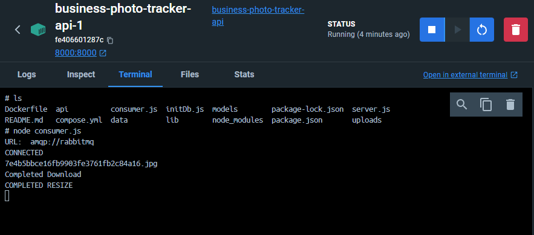

# Business-Photo-Tracker-API

<!-- TABLE OF CONTENTS -->
<details>
  <summary>Table of Contents</summary>
  <ol>
    <li>
      <a href="#about-the-project">About The Project</a>
      <ul>
        <li><a href="#built-with">Built With</a></li>
      </ul>
    </li>
    <li>
      <a href="#getting-started">Getting Started</a>
      <ul>
        <li><a href="#prerequisites">Prerequisites</a></li>
        <li><a href="#installation">Installation</a></li>
      </ul>
    </li>
    <li><a href="#usage">Usage</a></li>
   <li><a href="#contributors">Contributors</a></li>
   <li><a href="#contact">Contact</a></li>
   <li><a href="#acknowledgements">Acknowledgements</a></li>
  </ol>
</details>

<!-- ABOUT THE PROJECT -->
## About The Project


Business Photo Tracker API enables users to store and retrieve business data and photos. The API also automatically generates thumbnails for every uploaded photo that can also be retrieved. 

 * The API server is implemented using Node.js and Express.js to handle API URL requests.

 * The database uses mongo (docker image) to store and retrieve business information and GridFS to store and retrieve photos.

 * RabbitMQ is used to queue uploaded photos for consumers to generate new thumbnails in a separate process.

 * The consumer processes use Jimp to resize uploaded photos to thumbnails.
   
 * Docker is used to host and faciliatate the communication between the API server, database, and RabbitMQ processes

### Built With

* [Node.js][nodejs-url]
* [Express.js][express-url]
* [Jimp][jimp-url]
* [Ampqlib][ampqlib-url]
* [MongoDB][mongo-url]
* [RabbitMQ][rabbitmq-url]

<!-- GETTING STARTED -->
## Getting Started

### Prerequisites

This project was developed on Ubuntu 22.04.3 LTS (WSL2)

This is an example of how to list things you need to use the software and how to install them.
* Make sure your system is up to date
  ```sh
  sudo apt update
  ```
* Install node.js and npm
  * [Tutorial for Installing Node.js and NPM](https://phoenixnap.com/kb/install-latest-node-js-and-nmp-on-ubuntu#:~:text=1%20Type%20the%20command%3A%20sudo%20apt%20update%202,apt%20install%20npm%205%20Verify%20the%20installed%20version%3A)
* Install Docker Desktop
  * [Docker Desktop Download Location](https://www.docker.com/products/docker-desktop/)

### Installation

1. Clone the repo
   ```sh
   git clone https://github.com/Juichilee/Business-Photo-Tracker-API.git
   ```
2. Navigate inside project directory
   * Use `cd` to navigate inside "Business-Photo-Tracker-API/" folder
3. Install NPM packages
   ```sh
   npm install
   ```
4. Run application using docker command (make sure Docker is already running)
   ```sh
   docker compose up
   ```
5. Send HTTP requests to api server port using web browser, Postman, or Insomnia
   * Note: This application was tested using <b>Insomnia</b>. See Usage section for examples.
     

<!-- USAGE EXAMPLES -->
## Usage
Notes: 
* Default port to send requests to API server is `8000`
  
### GET /businesses

* Docker `compose.yml` automatically initializes database with business data stored in `/data/business.json`

### POST /business

* To insert a new business into the database, follow the demo image format or the schema outlined in `/models/business.js`
* Upon success, returns the `id` of the business you inserted

### GET /business/<id>


### GET /business?page=<pageNumber>

* API server outputs a default page size of 10
* Retrieve a specific page number through page query

### GET /business/<id>

* Specify a business id to retrieve in the URL

### POST /photos

* Insert a photo by sending a multipart form
* Uploads photo and photo metadata to GridFS bucket
* Upon success, returns links to the newly generated photo metadata and associated business id

### GET /photos/<id>

* Retrieves photo metadata associated with the photo id

### GET /media/photos/<id>

* Retrieves photo file associated with the photo id stored in GridFS

### Run Consumer.js on API Server to generate photo thumbnail

* Note: Thumbnail of uploaded photos cannot be generated until at least one consumer process is running within the API server container

### GET /media/thumbs/<id>

* Thumbnail image is the original photo except resized to 100 x 100 pixels

<!-- CONTRIBUTORS -->
## Contributors
* Juichi Lee

<!-- CONTACT -->
## Contact

* Email - juichi.lee.012@gmail.com
* LinkedIn - [https://www.linkedin.com/in/leejuic/](https://www.linkedin.com/in/leejuic/)
* Project Link: [https://github.com/Juichilee/Business-Photo-Tracker-API](https://github.com/Juichilee/Business-Photo-Tracker-API)

<!-- ACKNOWLEDGEMENTS -->
## Acknowledgements
* Many thanks to my web development and cloud development professor <b>[Rob Hess](https://github.com/robwhess)</b> for teaching me the essentials!

<!-- MARKDOWN LINKS & IMAGES -->
<!-- https://www.markdownguide.org/basic-syntax/#reference-style-links -->
[linkedin-url]: https://linkedin.com/in/othneildrew
[product-screenshot]: images/screenshot.png
[nodejs-url]: https://nodejs.org/en
[express-url]: http://expressjs.com/
[jimp-url]: https://www.npmjs.com/package/jimp
[ampqlib-url]: https://www.npmjs.com/package/amqplib
[mongo-url]: https://hub.docker.com/_/mongo/
[rabbitmq-url]: https://hub.docker.com/_/rabbitmq
